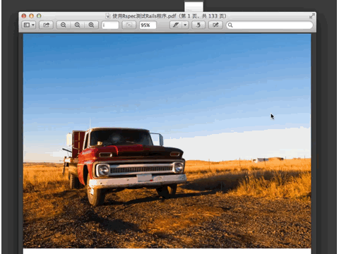

front-most-alfred-workflow
==========================

Reveal the file open by the front most window in Alfred

Press **⌘ + y** or type **fm** keyword in Alfred.app to reveal the file open by the front most window in Alfred.app.

You can modify the hotkey and keyword in "Workflow" panel of Alfred Preferences window.

If there're no file associated with the front most window or it could not obtain the file of the front mose window, then the file list in Alfred.app will be empty.

### Requirements:
 
 1. Alfred.app with PowerPack activated.
 
### Install steps:
 
 1. Download the `Front Most.alfredworkflow` file.
 
 2. Double-click it to install.

### Screenshots:
 

